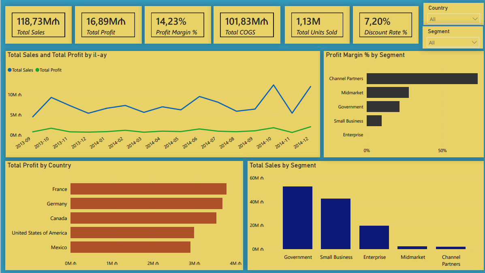

# Power BI — Satış və Maliyyə Analizi

## Layihə haqqında

Bu layihədə satış, mənfəət, məhsul, ölkə və müştəri seqmentləri üzrə biznes göstəricilərini analiz etmək üçün Power BI dashboardu hazırlanıb.

Məqsəd satış və mənfəətin zaman, ölkə, məhsul və seqmentlər üzrə necə dəyişdiyini analiz etmək və biznes üçün diqqət tələb edən sahələri müəyyən etməkdir.

## Əsas KPI-lar

- **Ümumi satış:** 118.73M ₼
- **Ümumi mənfəət:** 16.89M ₼
- **Mənfəət marjası:** 14.23%
- **Ümumi COGS:** 101.83M ₼
- **Satılan məhsul sayı:** 1.13M
- **Endirim faizi:** 7.20%

## Dashboard

### Səhifə 1 — Satış icmalı

Birinci səhifədə ümumi satış və mənfəət göstəricilərinə fokuslanılıb.

- Aylıq satış və mənfəət dinamikası
- Ölkələr üzrə mənfəət
- Seqmentlər üzrə satış
- Seqmentlər üzrə mənfəət marjası
- Ölkə və seqment filterləri

### Səhifə 2 — Məhsul və mənfəət analizi

İkinci səhifədə məhsul və ölkə səviyyəsində mənfəətlilik daha detallı analiz edilir.

- Məhsullar üzrə mənfəət
- Məhsullar üzrə mənfəət marjası
- Ölkələr üzrə mənfəət və mənfəət marjası
- Seqmentlər üzrə ətraflı performans cədvəli

## Əsas nəticələr

Ümumi biznes nəticəsi **14.23% mənfəət marjası** ilə müsbətdir.

Seqmentlər arasında ciddi fərqlər müşahidə olunur. **Channel Partners** 73.13% mənfəət marjası ilə ən yüksək göstəriciyə sahibdir. Digər tərəfdən, **Enterprise** seqmentində mənfəət marjası **-3.13%** təşkil edir və bu seqment əlavə araşdırma tələb edir.

Ölkələr üzrə də mənfəətlilik fərqlənir. Ən yüksək ümumi mənfəət marjası **Germany — 15.66%**, ən aşağı isə **United States of America — 11.97%** göstəricisindədir.

## İstifadə olunan alətlər

- Power BI
- Power Query
- DAX
- Data Modeling
- Data Visualization

## Layihənin məqsədi

Bu layihə real biznes ssenarisinə uyğun olaraq məlumatların hazırlanması, modelləşdirilməsi, DAX ilə KPI-ların hesablanması və nəticələrin interaktiv dashboard vasitəsilə təqdim edilməsi bacarıqlarını nümayiş etdirir.
